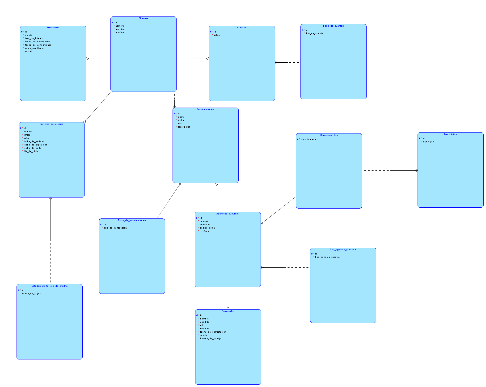
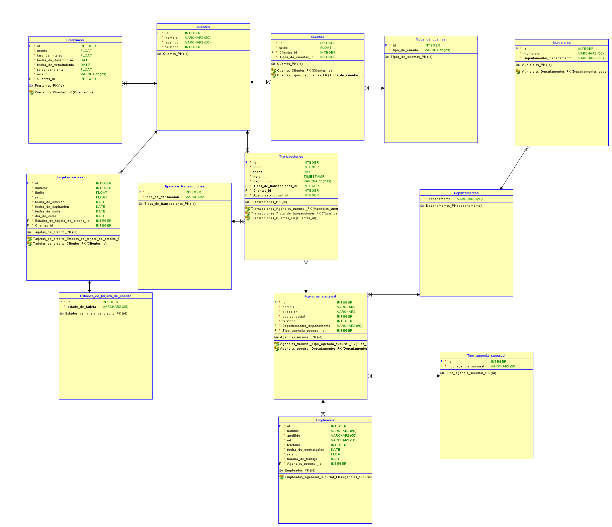

# Proyecto 1 Sistemas de bases de datos
 
 Primer proyecto del curso de bases de datos

 ## Modelo conceptual


## Diagrama matricial

| Tablas    | Clientes | Cuentas   | Tipos de cuentas | Transacciones| Tipos de transacciones | Prestamos | Tarjetas de credito| Tipo de tarjetas de credito| Agencias_sucursales|Tipo de agencias sucursales|Departamentos|Municipios|Empleados|
| - | - | - | - |-|-|-|-|-|-|-|-|-|-|
| __Clientes__  | - | 1:N | - | 1:N|-|1:N|1:N|-|-|-|-|-|-|
| __Cuentas__    | N:1 | - | N:1 | 1:N|-|-|-|-|-|-|-|-|-|
|__Tipos de cuentas__ | - | 1:N | - | -|-|-|-|-|-|-|-|-|-|
|__Transacciones__| 1:N | N:1 | - | -|1:N|-|-|-|1:N|-|-|-|-|
|__Tipos de transacciones__|-|-|-|N:1|-|-|-|-|-|-|-|-|-|
|__Prestamos__|N:1|-|-|-|-|-|-|-|-|-|-|-|-|-|
|__Tarjetas de credito__|N:1|-|-|-|-|-|-|1:N|-|-|-|-|-|
|__Tipos de tarjetas de credito__|-|-|-|-|-|-|N:1|-|-|-|-|-|-|
|__Agencias_sucursales__|-|-|-|N:1|-|-|-|-|-|N:1|-|1:N|1:N|
|__Tipo de agencias sucursales__|-|-|-|-|-|-|-|-|N:1|-|-|-|-|-|
|__Departamentos__|-|-|-|-|-|-|-|-|N:1|-|1:N|1:N|-|
|__Municipios__|-|-|-|-|-|-|-|-|-|1:N|-|-|-|
|__Empleados__|-|-|-|-|-|-|-|-|N:1|N:1|-|-|-|


## Normalizaciones

- Descompuse el atributo __Tipo de cuentas__ en otra tabla porque no depende de __Cuentas__ y se repite, corresponde a la 3FN.

- Descompuse el atributo __Tipos de transacciones__ en otra tabla porque no depende de __Transacciones__ y se repite, corresponde a la 3FN.

- Descompuse el atributo __Tipos de tarjetas de credito__ en otra tabla porque no depende de __Tarjetas de credito__ y se repite, corresponde a la 3FN.

## Modelo logico



## Modelo fisico



- __Prestamos__ 
Esta tabla guardara la informacion de los prestamos contiene un ID unico, un monto tipo FLOAT, una tasa de interes tipo FLOAT, una fecha de desembolso tipo DATE, una fecha de vencimiento tipo DATE, un saldo pendiente tipo FLOAT, un estado tipo VARCHAR de longitud 20 y una relacion de 1 a muchos con clientes lo cual refleja que un cliente puede tener muchos prestamos.

- __clientes__
Esta tabla guardara la informacion de los clientes contiene un ID unico, un nombre tipo VARCHAR de longitud 50, un apellido tipo VARCHAR de longitud 50, un telefeno tipo INT, una relacion de uno a muchos con prestamos lo cual refleja que un cliente puede tener muchos prestamos, una relacion de uno a muchos con cuentas lo cual refleja que un cliente puede tener muchas cuentas, una relacion de uno a muchos con transacciones lo cual refleja que un cliente puede tener muchas transacciones, una relacion de uno a muchos con tarjetas de credito lo cual refleja que un cliente puede tener muchas tarjetas de credito.

- __cuentas__
Esta tabla guardara la informacion de las cuentas contiene un ID unico, un saldo tipo FLOAT, una relacion de uno a muchos con clientes lo cual refleja que una cuenta puede tener muchos clientes, una relacion de uno a muchos con tipos de cuentas lo cual refleja que una cuenta puede tener muchos tipos de cuentas.

- __tipos de cuentas__
Esta tabla guardara la informacion de los tipos de cuentas contiene un ID unico, un nombre tipo VARCHAR de longitud 20, una relacion de uno a muchos con cuentas lo cual refleja que un tipo de cuenta puede tener muchas cuentas.

- __tarjetas de credito__
Esta tabla guardara la informacion de las tarjetas de credito contiene un ID unico, un numero de tarjeta tipo INT, una fecha de vencimiento tipo DATE, un saldo tipo FLOAT, una fecha de emision tipo DATE, una fecha de expiracion tipo DATE, una fecha de corte tipo DATE, un dia de ciclo tipo DATE, una relacion muchas a uno con clientes lo cual refleja que una tarjeta de credito puede tener muchos clientes, una relacion de uno a muchos con tipos de tarjetas de credito lo cual refleja que una tarjeta de credito puede tener muchos tipos de tarjetas de credito.

- __tipos de tarjetas de credito__
Esta tabla guardara la informacion de los tipos de tarjetas de credito contiene un ID unico, un nombre tipo VARCHAR de longitud 20, una relacion de uno a muchos con tarjetas de credito lo cual refleja que un tipo de tarjeta de credito puede tener muchas tarjetas de credito.

- __transacciones__
Esta tabla guardara la informacion de las transacciones contiene un ID unico, un monto tipo FLOAT, una fecha tipo DATE, una hora tipo timestamp, una descripcion VARCHAR de 200, una relacion de uno a muchos con clientes lo cual refleja que una transaccion puede tener muchos clientes, una relacion de uno a muchos con cuentas lo cual refleja que una transaccion puede tener muchas cuentas, una relacion de uno a muchos con tipos de transacciones.

- __tipos de transacciones__
Esta tabla guardara la informacion de los tipos de transacciones contiene un ID unico, un nombre tipo VARCHAR de longitud 20, una relacion de uno a muchos con transacciones lo cual refleja que un tipo de transaccion

- __agencias_sucursales__
Esta tabla guardara la informacion de las agencias sucursales contiene un ID unico, un nombre tipo VARCHAR de longitud 50, una direccion tipo VARCHAR de longitud 100, un codigo postal tipo INTEGER, un telefeno tipo integer, una relacion de uno a muchos con tipos de agencias sucursales lo cual refleja que una agencia sucursal puede tener muchos tipos de agencias sucursales, una relacion de uno a muchos con departamentos lo cual refleja que una agencia sucursal puede tener muchos departamentos, una relacion de uno a muchos con municipios lo cual refleja que una agencia sucursal puede tener muchos municipios, una relacion de uno a muchos con empleados lo cual refleja que una agencia sucursal puede tener muchos empleados.

- __tipos de agencias sucursales__
Esta tabla guardara la informacion de los tipos de agencias sucursales contiene un ID unico, un nombre tipo VARCHAR de longitud 20, una relacion de uno a muchos con agencias sucursales lo cual refleja que un tipo de agencia sucursal puede tener muchas agencias sucursales.

- __departamentos__
Esta tabla guardara la informacion de los departamentos contiene un ID unico, una relacion de uno a muchos con agencias sucursales lo cual refleja que un departamento puede tener muchas agencias sucursales, una relacion de uno a muchos con municipios lo cual refleja que un departamento puede tener muchos municipios.

- __municipios__
Esta tabla guardara la informacion de los municipios contiene un ID unico, un nombre tipo VARCHAR de longitud 50, una relacion de uno a muchos con agencias sucursales lo cual refleja que un municipio puede tener muchas agencias sucursales.

- __empleados__
Esta tabla guardara la informacion de los empleados contiene un ID unico, un nombre tipo VARCHAR de longitud 50, un apellido tipo VARCHAR de longitud 50, un telefono tipo INT,una fecha de contratacion tipo DATE, un salario tipo FLOAT, un horario de trabajo tipo TIME, una relacion de uno a muchos con agencias sucursales lo cual refleja que un empleado puede tener muchas agencias sucursales.

## Script de la base de datos

```sql

CREATE TABLE agencias_sucursal (
    id                         INTEGER NOT NULL,
    nombre                     VARCHAR2(20) NOT NULL,
    direccion                  VARCHAR2(50) NOT NULL,
    codigo_postal              INTEGER NOT NULL,
    telefono                   INTEGER NOT NULL,
    departamentos_departamento VARCHAR2(50) NOT NULL,
    tipo_agencia_sucursal_id   INTEGER NOT NULL
);

ALTER TABLE agencias_sucursal ADD CONSTRAINT agencias_sucursal_pk PRIMARY KEY ( id );

CREATE TABLE clientes (
    id       INTEGER NOT NULL,
    nombre   VARCHAR2(50) NOT NULL,
    apellido VARCHAR2(50) NOT NULL,
    telefono INTEGER NOT NULL
);

ALTER TABLE clientes ADD CONSTRAINT clientes_pk PRIMARY KEY ( id );

CREATE TABLE cuentas (
    id                  INTEGER NOT NULL,
    saldo               FLOAT NOT NULL,
    clientes_id         INTEGER NOT NULL,
    tipos_de_cuentas_id INTEGER NOT NULL
);

ALTER TABLE cuentas ADD CONSTRAINT cuentas_pk PRIMARY KEY ( id );

CREATE TABLE departamentos (
    departamento VARCHAR2(50) NOT NULL
);

ALTER TABLE departamentos ADD CONSTRAINT departamentos_pk PRIMARY KEY ( departamento );

CREATE TABLE empleados (
    id                    INTEGER NOT NULL,
    nombre                VARCHAR2(50) NOT NULL,
    apellido              VARCHAR2(50) NOT NULL,
    rol                   VARCHAR2(50) NOT NULL,
    telefono              INTEGER NOT NULL,
    fecha_de_contratacion DATE NOT NULL,
    salario               FLOAT NOT NULL,
    horario_de_trabajo    DATE NOT NULL,
    agencias_sucursal_id  INTEGER NOT NULL
);

ALTER TABLE empleados ADD CONSTRAINT empleados_pk PRIMARY KEY ( id );

CREATE TABLE estados_de_tarjeta (
    id                INTEGER NOT NULL,
    estado_de_tarjeta VARCHAR2(20) NOT NULL
);


ALTER TABLE estados_de_tarjeta ADD CONSTRAINT estados_de_tarjeta_de_credito_pk PRIMARY KEY ( id );

CREATE TABLE municipios (
    id                         INTEGER NOT NULL,
    municipio                  VARCHAR2(50) NOT NULL,
    departamentos_departamento VARCHAR2(50) NOT NULL
);

ALTER TABLE municipios ADD CONSTRAINT municipios_pk PRIMARY KEY ( id );

CREATE TABLE prestamos (
    id                   INTEGER NOT NULL,
    monto                FLOAT NOT NULL,
    tasa_de_interes      FLOAT NOT NULL,
    fecha_de_desembolso  DATE NOT NULL,
    fecha_de_vencimiento DATE NOT NULL,
    saldo_pendiente      FLOAT NOT NULL,
    estado               VARCHAR2(20) NOT NULL,
    clientes_id          INTEGER NOT NULL
);

ALTER TABLE prestamos ADD CONSTRAINT prestamos_pk PRIMARY KEY ( id );

CREATE TABLE tarjetas_de_credito (
    id                               INTEGER NOT NULL,
    numero                           INTEGER NOT NULL,
    limite                           FLOAT NOT NULL,
    saldo                            FLOAT NOT NULL,
    fecha_de_emision                 DATE NOT NULL,
    fecha_de_expiracion              DATE NOT NULL,
    fecha_de_corte                   DATE NOT NULL,
    dia_de_ciclo                     DATE NOT NULL, 
    estados_de_tarjeta_de_credito_id INTEGER NOT NULL,
    clientes_id                      INTEGER NOT NULL
);

ALTER TABLE tarjetas_de_credito ADD CONSTRAINT tarjetas_de_credito_pk PRIMARY KEY ( id );

CREATE TABLE tipo_agencia_sucursal (
    id                    INTEGER NOT NULL,
    tipo_agencia_sucursal VARCHAR2(20) NOT NULL
);

ALTER TABLE tipo_agencia_sucursal ADD CONSTRAINT tipo_agencia_sucursal_pk PRIMARY KEY ( id );

CREATE TABLE tipos_de_cuentas (
    id             INTEGER NOT NULL,
    tipo_de_cuenta VARCHAR2(20) NOT NULL
);

ALTER TABLE tipos_de_cuentas ADD CONSTRAINT tipos_de_cuentas_pk PRIMARY KEY ( id );

CREATE TABLE tipos_de_transacciones (
    id                  INTEGER NOT NULL,
    tipo_de_transaccion VARCHAR2(30) NOT NULL
);

ALTER TABLE tipos_de_transacciones ADD CONSTRAINT tipos_de_transacciones_pk PRIMARY KEY ( id );

CREATE TABLE transacciones (
    id                        INTEGER NOT NULL,
    monto                     FLOAT NOT NULL,
    fecha                     DATE NOT NULL,
    hora                      TIMESTAMP NOT NULL,
    descripcion               VARCHAR2(200) NOT NULL,
    tipos_de_transacciones_id INTEGER NOT NULL,
    clientes_id               INTEGER NOT NULL,
    agencias_sucursal_id      INTEGER NOT NULL
);

ALTER TABLE transacciones ADD CONSTRAINT transacciones_pk PRIMARY KEY ( id );

ALTER TABLE agencias_sucursal
    ADD CONSTRAINT agencias_sucursal_departamentos_fk FOREIGN KEY ( departamentos_departamento )
        REFERENCES departamentos ( departamento );

 
ALTER TABLE agencias_sucursal
    ADD CONSTRAINT agencias_sucursal_tipo_agencia_sucursal_fk FOREIGN KEY ( tipo_agencia_sucursal_id )
        REFERENCES tipo_agencia_sucursal ( id );

ALTER TABLE cuentas
    ADD CONSTRAINT cuentas_clientes_fk FOREIGN KEY ( clientes_id )
        REFERENCES clientes ( id );

ALTER TABLE cuentas
    ADD CONSTRAINT cuentas_tipos_de_cuentas_fk FOREIGN KEY ( tipos_de_cuentas_id )
        REFERENCES tipos_de_cuentas ( id );

ALTER TABLE empleados
    ADD CONSTRAINT empleados_agencias_sucursal_fk FOREIGN KEY ( agencias_sucursal_id )
        REFERENCES agencias_sucursal ( id );

ALTER TABLE municipios
    ADD CONSTRAINT municipios_departamentos_fk FOREIGN KEY ( departamentos_departamento )
        REFERENCES departamentos ( departamento );

ALTER TABLE prestamos
    ADD CONSTRAINT prestamos_clientes_fk FOREIGN KEY ( clientes_id )
        REFERENCES clientes ( id );

ALTER TABLE tarjetas_de_credito
    ADD CONSTRAINT tarjetas_de_credito_clientes_fk FOREIGN KEY ( clientes_id )
        REFERENCES clientes ( id );

ALTER TABLE tarjetas_de_credito
    ADD CONSTRAINT tarjetas_de_credito_estados_de_tarjeta_de_credito_fk FOREIGN KEY ( estados_de_tarjeta_de_credito_id )
        REFERENCES estados_de_tarjeta ( id );

ALTER TABLE transacciones
    ADD CONSTRAINT transacciones_agencias_sucursal_fk FOREIGN KEY ( agencias_sucursal_id )
        REFERENCES agencias_sucursal ( id );

ALTER TABLE transacciones
    ADD CONSTRAINT transacciones_clientes_fk FOREIGN KEY ( clientes_id )
        REFERENCES clientes ( id );

ALTER TABLE transacciones
    ADD CONSTRAINT transacciones_tipos_de_transacciones_fk FOREIGN KEY ( tipos_de_transacciones_id )
        REFERENCES tipos_de_transacciones ( id );


```