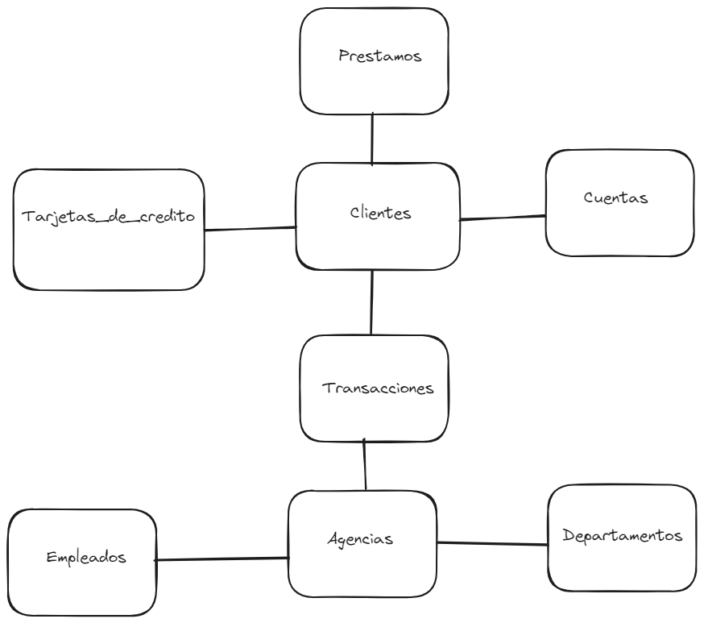

# Proyecto 1 Sistemas de bases de datos
 
 Primer proyecto del curso de bases de datos

 ## Modelo conceptual

## Diagrama matricial

| Tablas    | Clientes | Cuentas   | Tipos de cuentas | Transacciones| Tipos de transacciones
| - | - | - | - |-|-|
| __Clientes__  | - | 1:N | - | 1:N|-|
| __Cuentas__    | N:1 | - | N:1 | 1:N|-|
|__Tipos de cuentas__ | - | 1:N | - | -|-|
|__Transacciones__| 1:N | N:1 | - | -|1:N|
|__Tipos de transacciones__|-|-|-|N:1|-

## Normalizaciones

- Descompuse el atributo __Tipo de cuentas__ en otra tabla porque no depende de __Cuentas__ y se repite, corresponde a la 3FN.

- Descompuse el atributo __Tipos de transacciones__ en otra tabla porque no depende de __Transacciones__ y se repite, corresponde a la 3FN.